# LMFO AI – Pattern Recognition in Real-World Noisy Environments 

<strong>Table of Contents</strong>

- [Overview](#-overview)
- [Key Features](#-key-features)
- [Real-World Impact](#-real-world-impact)
  - [Predictive Maintenance — Risk Analysis & Early Warning](#predictive-maintenance--risk-analysis--early-warning)
  - [Multi-Sector Adaptability](#multi-sector-adaptability)
- [Benchmark Environment & High-Noise Real-World Dataset](#-benchmark-environment--high-noise-real-world-dataset)
- [Performance Evaluation & Settings](#-performance-evaluation--settings)
- [Applied Results — Pattern Recognition & Generalization](#-applied-results--pattern-recognition--generalization)
  - [Pattern Recognition on the Validation Set](#pattern-recognition-on-the-validation-set)
    - [Optimized Seeds (Validation)](#optimized-seeds)
    - [Random Seeds (Validation)](#random-seeds)
  - [Generalization on the Test Set](#generalization-on-the-test-set)
    - [Optimized Seeds (Test)](#optimized-seeds-1)
    - [Random Seeds (Test)](#random-seeds-1)
  - [Generalization, Robustness, and Consistency](#generalization-robustness-and-consistency)
- [Reproduction Package](#-reproduction-package)
  - [Quick Run](#-quick-run)
- [Additional Context](#additional-context)

## 🔍 Overview  

LMFO AI (Layered Multiple Frequency Optimization) is an **artificial-intuition–driven decision support system** designed for real-world environments with **limited data and low signal-to-noise ratios (SNR)**. Through context-aware pattern recognition, LMFO distinguishes critical information from background noise and derives actionable patterns.  

  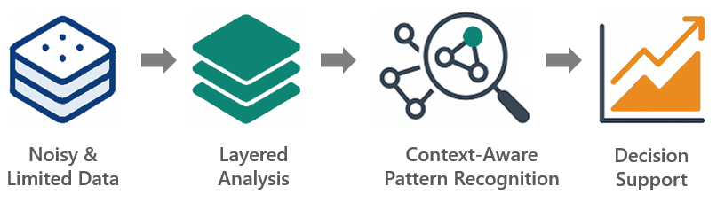 
  <em>Weak signal &rarr; Contextual analysis &rarr; Strong pattern &rarr; Decision support</em> 

  

LMFO AI combines machine learning (ML) with metaheuristics, and goes further. It preserves **weak signals** that gain meaning in context (beyond ML’s strong-signal bias) and steers search with data-driven prioritization, adaptive search strategies (beyond random exploration in metaheuristics).  

Implemented in **Python** as a prototype, LMFO was **validated on public real-world datasets** with limited data and high noise. Extensive testing confirmed its ability to deliver consistent, robust, and generalizable results.  

Originally developed for **predictive maintenance and risk analytics**, its modular and scalable architecture enables seamless adaptation across domains — including industrial automation, automotive, energy, finance, and bioinformatics — where reliable insights under uncertainty are required.  

→ **Problem:** High noise, limited data  
→ **Solution:** Layered, data-driven, context-aware inference  
→ **Proof:** Independent, statistically validated results showing generalization, robustness, and consistency

<strong><em>LMFO Workflow At a Glance</em></strong>

  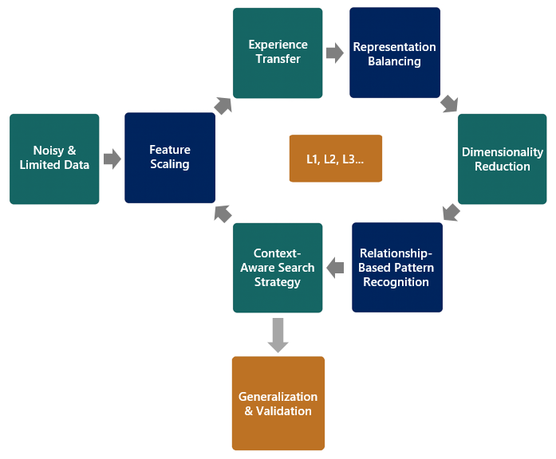 
  <em>End-to-end workflow: from noisy data to validated patterns</em> 

<strong><em>LMFO Architecture At a Glance</em></strong>

  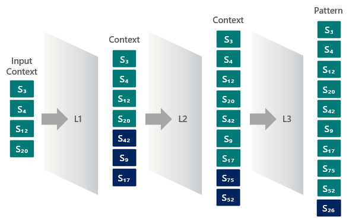 
  <em>Layered context pass (L1 &rarr; L3)</em> 

  

<strong><em>LMFO Real-World Impact At a Glance</em></strong>

  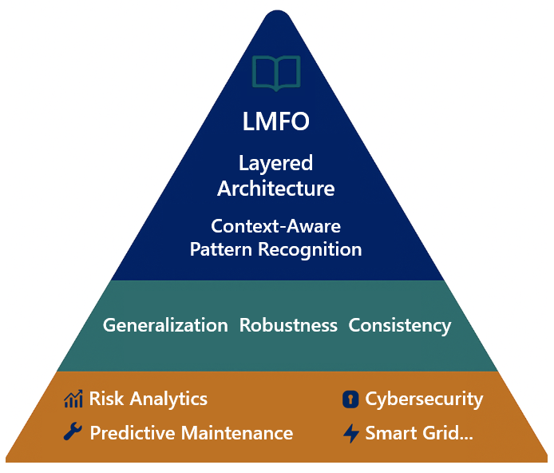 
  <em>Reliable decision support in scarce data, high noise environments</em> 

  

---

## ✨ Key Features

- **Multi-Layer Architecture (L1 → L2 → L3)**  
  Progressively narrows large, noisy search spaces; each layer refines candidate patterns in a coarse-to-fine flow.

- **Context-Aware Inference (Strong + Weak Signals)**  
  Retains weak as well as strong signals; uses context to turn them into meaningful patterns.

- **Experience Transfer & Representation Balancing**  
  Transfers experience across runs — using prior signal blocks as context — and rebalances under-represented signals to preserve rare, high-value patterns.

- **Data-Driven Prioritization & Adaptive Search**  
  Ranks candidates by information value and relevance, focuses on high-potential regions, and redirects away from low-yield areas as feedback accumulates.

- **Relationship-Based Pattern Recognition**  
  Regroups signals by context to build richer patterns, and restores context-relevant features lost during reduction — recovering diversity without increasing dimensionality.

- **Validated, Reproducible Prototype**  
  Independently tested on limited, high-noise real-world datasets; delivers robust, generalizable results.

---

## 📊 Real-World Impact

  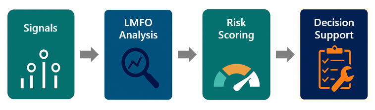 
  <em>Real-world business value of LMFO AI</em> 

   

### Predictive Maintenance — Risk Analysis & Early Warning
- **Problem** — A line with ~100 sensors shows ~25 abnormal signals during a failure, but combinations vary each time (no single “failure signature”); the solution space is astronomical (~2×10^23).
- **LMFO’s contribution** — From limited failure records, extracts **10-sensor indicator patterns**; issues **graded alerts** (5–6 = early, 7–8 = strong, 9–10 = critical), reducing false positives and anticipating unseen scenarios.
- **Business value** — Industry reports for predictive maintenance cite **30–50% less unplanned downtime**, **20–40% longer equipment life**, **5–10% lower maintenance costs**, and **10–20% higher uptime** (McKinsey 2017; Deloitte 2017; PwC/Mainnovation 2018; Siemens–Senseye case studies 2021–2024).

### Multi-Sector Adaptability
Feature-agnostic, layered architecture that generalizes across domains:
- **Cybersecurity (SOC / Threat Detection)** — Surfaces **8 critical signatures** from ~90 log types; grades threat levels by partial matches.
- **Finance / Fraud Analytics** — Extracts a **7-indicator pattern** from ~80 risk indicators; scores transaction flows in real time by match level.
- **Energy / Smart Grid** — Finds **10 critical patterns** from ~75 parameters; anticipates and mitigates regional failures in advance.

---

## 🧪 Benchmark Environment & High-Noise Real-World Dataset

- **Dataset** — Public *On Numara* (“Number Ten”, Turkey): extremely low SNR, limited observations, and a vast combinatorial search space.

- **Problem framing** — 80 items; 22 are active per event. The active items vary across events—there is no single "critical signature". This creates high uncertainty at scale.

- **Challenges**
  - **Scale issue:** astronomical number of potential combinations — **C(80,22) ≈ 2.7×10¹⁹**
  - **Data issue:** only **~1.200** events observed — **>99,99%** of the space remains unseen
  - **Noise issue:** weak yet context-relevant signals are easily lost

- **Real-World Relevance** — Mirrors real-world cases where, under limited data and low SNR, critical event signatures must be identified through **indicative patterns**, even before all indicators fully emerge.

- **Indicative-pattern solution** — Extract **10-element indicator patterns** from the 22 active items per event, yielding:
  1) **Scalability**: shrinks the search into a focused domain  
  2) **Focused visibility**: turns limited observations into a tractable solution space  
  3) **Signal preservation**: retains weak-but-contextual signals

<strong><em>Scaling At a Glance</em></strong>

  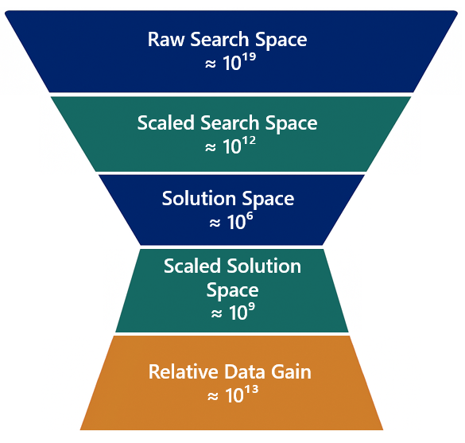 
  <em>From astronomical search space to a tractable solution space — with large relative data gain.</em> 

As pattern intensity increases, signals become exponentially rarer—hence sustaining performance at higher match levels (9/10–10/10) is especially challenging.  

<strong><em>Pattern & Signal Intensity</em></strong>

  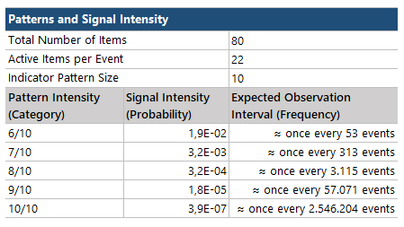 

---

## 📈 Performance Evaluation & Settings

- **Approach** — Instead of parameter optimization, LMFO directly optimizes indicative patterns — signals that may appear meaningless individually but gain significance in context. Performance is evaluated at the pattern level, not on individual signals.

- **Protocol**
  1) **Validation set** — held out from training to get the first performance signal  
  2) **Test set** — independent data to verify generalization  
  3) **Stepwise evaluation** — assess performance across pattern-intensity buckets (e.g., 5/10 … 10/10) for consistency and robustness  
  4) **Joint assessment** — compare validation vs test to confirm stability

  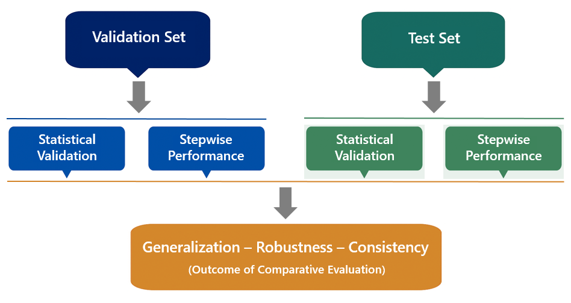 
  <em>Validation & test workflow</em>

- **Metrics**
  - **PRS (Pattern Recognition Score)** — accuracy normalized by signal density (**>1** = above expected; **<1** = below)  
  - **EPS (Expected Pattern Score)** — standardized scale with **baseline = 1** 
  - **Significance** — one-tailed z-test, **p < 0,05**

- **Interpretation example**
  - 8/10 bucket: **PRS = 1,72** → 72% above expected  
  - 9/10 bucket: **PRS = 0,95** → 5% below expected

- **Initialization** — Runs start either from scratch or with small seeds (3–4 items) to trigger context analysis from Layer 1.
- **Seeding regimes** — Two core regimes are evaluated: **optimized seeds** (from prior runs) and **random seeds**; both are supplied as initial solutions.
- **Layered expansion** — Seeds propagate across layers (L1→L2→L3) and consolidate into **10-item indicative patterns** via a coarse-to-fine flow.
- **Objectives:**
  1) assess pattern recognition under high noise
  2) test whether weak signals become strong in context
  3) verify extraction from random seeds
  4) check consistency across initial conditions
- **Evaluation setup** — Multiple predefined configs; train on train, validate on val, test on test; results averaged across configs (metrics: **PRS**, **EPS**).

---

## 🎯 Applied Results — Pattern Recognition & Generalization

### Pattern Recognition on the Validation Set  

#### Optimized Seeds  

Across all signal densities (6/10–10/10), LMFO exceeds the expected baseline (EPS=1) with statistical significance (p < 0,05).  

  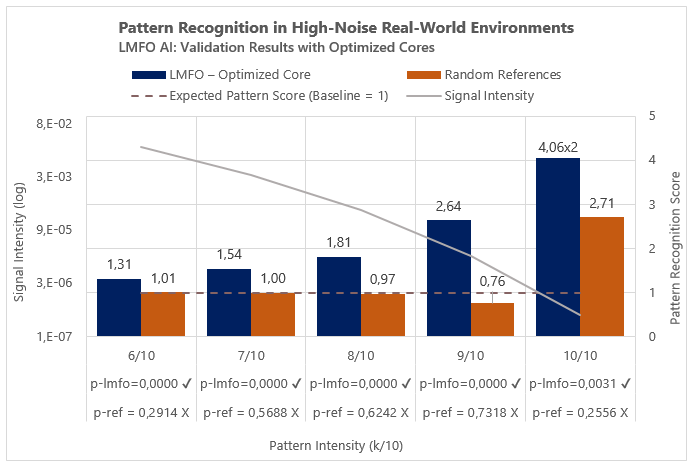

  

- 6/10–7/10 (high): **31–54%** higher score  
- 8/10 (medium): **81%** higher score  
- 9/10–10/10 (low): **×2,64** and **×8,12** higher score  

**Takeaway:** Patterns extracted under **low signal density achieved scores up to 8× higher** than the baseline (EPS = 1). This finding highlights LMFO’s mechanism of “reconstructing weak signals within context”.  

**Note:** In the 10/10, random references deviated from baseline, but not significant (p = 0,2556).  

#### Random Seeds  

Across 6/10–9/10, results still remain above baseline (p < 0,05); but 10/10 not significant (p = 0,4325).  

  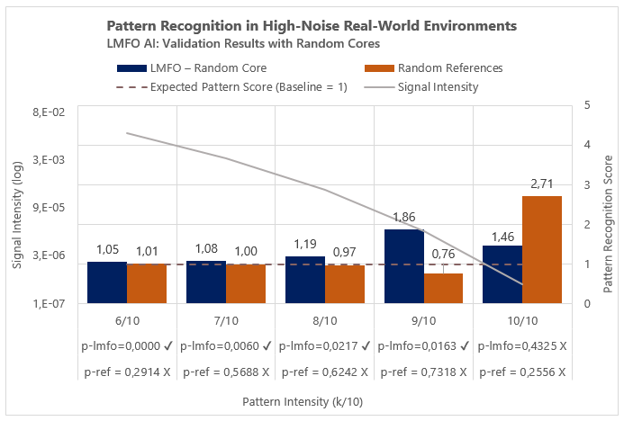

    

- 6/10–7/10 (high): **5–8%** higher score  
- 8/10 (medium): **19%** higher score  
- 9/10 (low): **86%** higher score  

**Takeaway:** Even with no prior information, **the strong performance at low signal density (86%)** demonstrates the algorithm’s ability to "quickly identify relevant signals" and "adaptively reorient the search". These results confirm LMFO’s **robustness** under high-noise and low-signal conditions.  

### Generalization on the Test Set

#### Optimized Seeds  

**Validation trends are preserved** on the independent data (6/10–9/10 significant at p < 0,05).  

  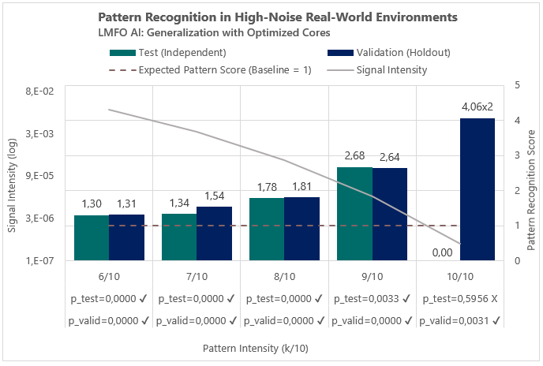

  

- 6/10–7/10 (high): **30–34%** higher score    
- 8/10 (medium): **78%** higher score    
- 9/10 (low): **×2,68** higher score  

**Takeaway:** Context-aware inference **generalizes** beyond validation; stability holds across densities 6/10–9/10.  

**Note:** At the weakest signal density (10/10), no statistically significant difference was observed (p = 0,5956), likely due to the limited size of the test set.  

#### Random Seeds  

Generalization maintained across all signal densities in the 6/10–9/10 range even with random seeds (p < 0,05).  

  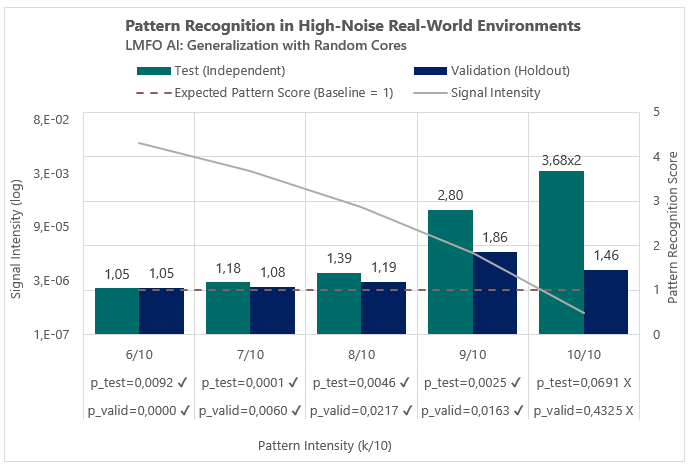

    

- 6/10–7/10 (high): **5–18%** higher score    
- 8/10 (medium): **39%** higher score    
- 9/10 (low): **×2,80** higher score    
- 10/10 (weakest): **×7,36** higher score (significant at **90%**, p = 0,0691)

**Takeaway:** **Robustness** persists with random seeds; strongest lifts appear in low-signal regimes.

### Generalization, Robustness, and Consistency  

The table below summarizes the pattern scores and significance levels across the validation and test sets by density and seed type.  

  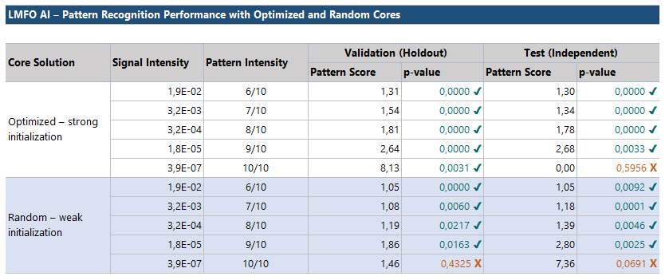

    

LMFO extracts **stable, generalizable patterns** under both strong and weak contextual conditions.

  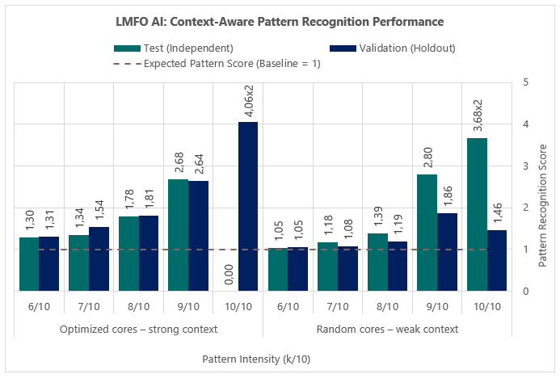

    

Pattern recognition performance of LMFO across different signal densities in the validation and test sets:

- **High & medium (6/10–8/10)**
  - **Optimized seeds:** Validation ≈ Test (**1,30–1,81**).
  - **Random seeds:** Lower (**1,05–1,39**) yet above baseline; generalization preserved.  

- **Low (9/10–10/10)**
  - **Optimized seeds:** 9/10 strong & stable (**2,64 → 2,68**); 10/10 strong on validation (**8,12**) but not significant on test.
  - **Random seeds:** 9/10 consistent & significant (**1,86 → 2,80**); 10/10 not significant on validation (1,46) but **7,36×** on test (90% level).  

**Takeaway:** LMFO remains reliable under high noise and the **largest gains emerge as signal density decreases**. The **consistency** between validation and test sets demonstrates the algorithm’s ability to deliver **reliable and generalizable** results in challenging scenarios. Moreover, maintaining consistency across both different initialization conditions and varying signal densities strongly confirms LMFO’s **robustness**.

---

## 📦 Reproduction Package

To ensure **full reproducibility and transparency**, all system files, control tools, and supplementary guides are included in:

➡️ [LMFO-AI_V01.zip](./LMFO-AI_V01.zip)

This package contains:
- **Python Core (L1–L3 + Runner)** — main LMFO algorithm
- **Control File** — companion tool for data preparation, decoding, and validation/test workflows
- **Supplementary READMEs** — detailed guides covering Control File usage, LMFO run procedures, and step-by-step validation/test reproduction
- **Benchmark Reports** — Excel tables, charts, and screenshots of validation/test results

### ⚡ Quick Run
The package is also pre-configured with a **quick run profile** (3 optimized seeds, short runtime).  
This allows users to **verify the workflow end-to-end** (run → output → validation) in just a few minutes, before moving on to full-scale runs with all seeds and profiles.

### ⚙️ Requirements
- Python 3.9+  
- Packages: `numpy`, `pandas`, `imblearn`  

### ▶️ How to Run
1. Clone the repository  
2. Run `RUN_LMFO.py`
3. Open `control_file-validation.xlsm` → LMFO Tab → click **Decode Set** and then **Test Set**

---

## Additional Context  

For readers interested in the architectural foundations, intuition-driven mechanisms, and real-world applications of LMFO—in particular, its conceptual “artificial intuition” framework—check out this [detailed blog article](https://ishakkutlu.com/lmfo-ai-pattern-recognition-in-noisy-data-with-artificial-intuition/).  

It delves into the layered design, data-driven prioritization, validation pipeline, and business value in far greater depth than the README.  

